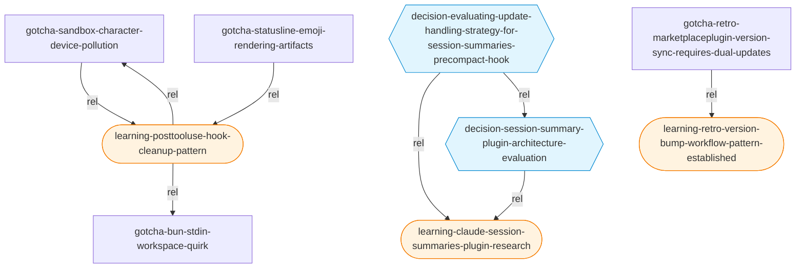

```mermaid
flowchart TB
  gotcha-sandbox-character-device-pollution["gotcha-sandbox-character-device-pollution"]
  learning-posttooluse-hook-cleanup-pattern(["learning-posttooluse-hook-cleanup-pattern"])
  gotcha-statusline-emoji-rendering-artifacts["gotcha-statusline-emoji-rendering-artifacts"]
  gotcha-bun-stdin-workspace-quirk["gotcha-bun-stdin-workspace-quirk"]
  decision-evaluating-update-handling-strategy-for-session-summaries-precompact-hook{{"decision-evaluating-update-handling-strategy-for-session-summaries-precompact-hook"}}
  decision-session-summary-plugin-architecture-evaluation{{"decision-session-summary-plugin-architecture-evaluation"}}
  learning-claude-session-summaries-plugin-research(["learning-claude-session-summaries-plugin-research"])
  gotcha-retro-marketplaceplugin-version-sync-requires-dual-updates["gotcha-retro-marketplaceplugin-version-sync-requires-dual-updates"]
  learning-retro-version-bump-workflow-pattern-established(["learning-retro-version-bump-workflow-pattern-established"])
  gotcha-sandbox-character-device-pollution -->|rel| learning-posttooluse-hook-cleanup-pattern
  learning-posttooluse-hook-cleanup-pattern -->|rel| gotcha-sandbox-character-device-pollution
  learning-posttooluse-hook-cleanup-pattern -->|rel| gotcha-bun-stdin-workspace-quirk
  gotcha-statusline-emoji-rendering-artifacts -->|rel| learning-posttooluse-hook-cleanup-pattern
  decision-evaluating-update-handling-strategy-for-session-summaries-precompact-hook -->|rel| learning-claude-session-summaries-plugin-research
  decision-session-summary-plugin-architecture-evaluation -->|rel| learning-claude-session-summaries-plugin-research
  decision-evaluating-update-handling-strategy-for-session-summaries-precompact-hook -->|rel| decision-session-summary-plugin-architecture-evaluation
  gotcha-retro-marketplaceplugin-version-sync-requires-dual-updates -->|rel| learning-retro-version-bump-workflow-pattern-established

  classDef learning fill:#fff3e0,stroke:#f57c00
  classDef decision fill:#e1f5fe,stroke:#0288d1
  class learning-posttooluse-hook-cleanup-pattern,learning-claude-session-summaries-plugin-research,learning-retro-version-bump-workflow-pattern-established learning
  class decision-evaluating-update-handling-strategy-for-session-summaries-precompact-hook,decision-session-summary-plugin-architecture-evaluation decision
```
